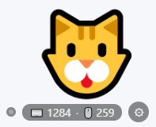
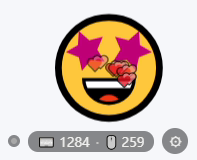
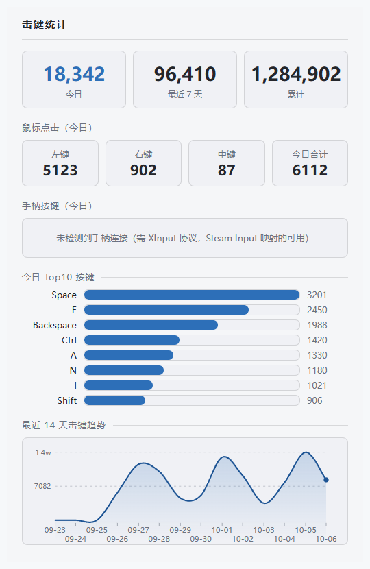

# Showcase 桌宠 🐱


常驻 Windows 桌面的 emoji 桌宠：全局按键/鼠标点击统计（仅本地存储）、摸头拖拽交互、久坐提醒、换皮肤、隐藏到托盘、Ctrl+三击走过去。**不上传任何数据，不记录输入内容与窗口标题。**

安装包在 [GitHub Releases](https://github.com/LISAPathfinder/show-memepet/releases/latest)（约 108 MiB，未签名，首次运行有 SmartScreen 提示）；源码同步镜像在 [Gitee](https://gitee.com/lpfspace/show-memepet)——Gitee 社区版单附件 100 MB 上限装不下这个包，所以那边只放源码。

> **这个项目是 AI 做的。** 架构、实现、判据脚本、排障与文档都由 AI 会话产出，人负责定产品形态、在真机上验收、以及否决方案。
> 曾用名 desktop-pet（2026-10 改名，1.0.49 起；升级链与数据目录不受影响，见 PITFALLS §66 与 CHANGELOG 1.0.49 条目）。

**文档地图**——怎么用怎么配：本文；出问题怎么查：[DIAGNOSTICS.md](DIAGNOSTICS.md)（诊断件台账）与 [PITFALLS.md](PITFALLS.md)（成因与解法，含一次「同一症状修了 7 轮」的方法复盘）；为什么这么设计：[PLAN.md](PLAN.md)；改了什么：[CHANGELOG.md](CHANGELOG.md)；许可：[LICENSE](LICENSE)。
技术栈的取舍与「想用原生框架重写」时该接哪几层，见文末「技术取舍」一节。

## 先看一眼

<p align="center">
  
  
</p>

<p align="center">
  
</p>

- 前两张是**内置 emoji 皮肤**在 Windows 上的真实渲染截图（Segoe UI Emoji 字形，开箱不需要任何素材文件），第二张是点它摸头之后的 `happy` 状态；底部计数栏左起依次是**管理员权限指示灯**（灰＝普通权限）、`⌨ 键盘 · 🖱 鼠标` 累计数、⚙ 菜单齿轮。
- **图里的数字是演示值，不是真实按键记录**：计数栏的 `⌨ 1284 · 🖱 259` 来自一个临时数据目录里预置的按天文件，统计面板那张由 `electron tools/preview-stats.js <输出.png>` 注入模拟数据渲染。你本机看到的数量与图中无关。
- 三张图统一压在 `#f6f8fa` 底色上（不带透明通道），这样深色模式下 emoji 的黑色描边不会融进背景。公开版不含贴纸皮肤，想换成自己的图片皮肤见「换皮肤」一节，素材授权边界见文末「开源与素材说明」。

## 启动

```bash
npm install
npm start
```

- 要求 Node.js 18+（开发机为 v24）。首次 `npm install` 后若 Electron 二进制缺失，执行 `npx electron --version` 会自动补下（已配置国内镜像 [.npmrc](.npmrc)）。
- `uiohook-napi` 的安装脚本需在 npm 询问时批准（npm 11 的 install-scripts 机制），或手动：
  ```bash
  npm install-scripts approve uiohook-napi && npm rebuild uiohook-napi
  ```

## 功能

功能按使用场景分组列出。原先挤在表格单元格里的长句拆成了要点，语义未改、版本注记（`1.0.xx`）保持原位。

### 窗口与置顶

- **桌宠窗口** —— **固定 600×600 透明无边框窗**（1.0.52 起；桌宠视觉区 300×300 ×缩放，钉在窗口右下角），`screen-saver` 级置顶（压过任务栏与其他置顶窗口），且**不抢焦点**——全屏游戏/视频里照常可见、可点击拖动，不会把游戏切到后台
  - 透明区域鼠标穿透不挡操作。**可见内容**（脸 + 底部计数栏，约 300×160）才参与贴边与出屏判定，头顶 ~154px 是气泡/💤 的渲染预留，1.0.64 起不算桌宠本体 ⇒ **脸能贴到屏幕上缘**（旧口径隔着一截空白）
- **进程分组** —— 任务管理器里 4 个进程（主/GPU/网络/渲染）+ 1 个不可见锚点窗口收成**一条可展开条目** `Showcase (5)`，一次「结束任务」即可整只关掉
- **稳定性** —— 穿透状态由主进程按真实光标判定（页面被系统节流也不会卡住）
  - 渲染进程崩溃/僵住自动重载
  - **锁屏解锁后自动重建窗口**，避免「回来点不动」
  - 退出前全量收尾并有 3 秒兜底强杀
- **紧急恢复** —— 连续按 **Ctrl → Alt → P**（顺序不限、中间不插别的键）：强制恢复可交互并弹出菜单（万一出现点不动时不用去任务管理器）
- **隐藏与托盘** —— ⚙ 菜单 →「隐藏桌宠」：桌宠、计数、齿轮一起消失，**计数照常后台运行**
  - 托盘图标（左键切换显隐／右键菜单：显示桌宠、打开统计面板、退出）是唯一入口。Windows 11 默认把新图标收进 `^` 折叠区，需要时把它拖到任务栏上固定

### 交互与手势

- **动画** —— 帧序列抽象（v1 emoji 帧），状态机：idle / blink / happy / sleep / wow / remind / drag（拖动桌宠时展示）/ move（走过去时展示）
- **交互** —— 点击摸头（爱心粒子）、10 秒内连点 5 次「别戳啦！」、按住拖动（≥5px 判拖拽）、双击打开统计面板（**默认关**，菜单「双击桌宠打开统计面板」勾选开启）
- **缩放** —— **按住 Ctrl** → 桌宠左上方出现**发光三角手柄**（正方形对角线斜切上半，统计面板蓝色系，大小为底部计数栏高度的 0.65 倍）→ **拖手柄缩放**（向下拖缩小、向上拖放大）等比缩放，0.5x~2.0x
  - **右下角锚定原地伸缩**——桌宠朝手柄方向生长/收缩、右下角不动，手柄拖动全程贴着桌宠不脱离
  - 缩放全程**零窗口操作**（固定 600×600 透明窗 + 纯 CSS transform），无闪烁抽搐
  - 拖到 0.5x/2.0x 顶格再继续拖，手柄**变红保持发光**提示到限
  - 松手持久化，比例保持、重启保持（1.0.39 起手势从「Ctrl+按脸拖动」移交手柄，Ctrl+拖脸现在就是普通移动）
- **让路穿透** —— **右键桌宠** → 2 秒「让一让」：桌宠**保持置顶不动**，整体**变暗并变透明**（brightness 0.35 + opacity 0.4），同时整窗点击穿透——点在它身上就是点在下层的文件/按钮，到点自动复原（亮度、透明度、常态穿透判定）。参考 Bongo Cat 的同名交互（1.0.72 内曾按「压到桌面层」实现，按用户实测裁决改为视觉让路、不动 z 序）
  - 拖拽/缩放/拖文件悬停期间右键不触发
  - 期间 Ctrl+Alt+P 救援照常可用（会提前收场）
- **走过去** —— **按住 Ctrl + 在任意位置快速连点左键三下** → 桌宠**走过去**（约 230px/秒，逐帧推进窗口位置、帧间隔 8ms≈60Hz，近距离最短 0.5 秒、最远 6 秒），途中显示 `move` 状态、向左走时朝向翻转，到达后回 idle 并记住位置。带修饰键是为了和系统「三击选段」区分开
  - 菜单里可关
- **移动状态** —— 状态机新增 `move`（走路），与拖拽一样可被图片皮肤覆盖：`assets/skins/<皮肤名>/move.gif` 或「挑选表情映射…」里给「移动」挑图
  - emoji 皮肤默认 🐈 + 走路颠簸动画
- **移动与位置** —— 拖动全程被**钳进显示器工作区**（1.0.63 起，桌宠拖不出屏幕）
  - 解锁/唤醒后位置**不弹回主屏右下角**（1.0.60 起：先按原位建窗再延迟复查，贴边悬出走最小位移回挪，只有真出屏——拔屏、分辨率收缩——才归位默认角，且每次决策都落日志）
  - 锁屏/唤醒会重建窗口，表现为**闪一下**（正常）
- **自动让开** —— 鼠标**停在桌宠身上超过 5 秒**不动 → 它自己走开：**向下与左右同时生效**（向下优先、能往下就挪到工作区极限，还离不开光标的部分由左右补上 —— 常见形态是「斜着往下-侧挪」，左右取挪得少的一侧）
  - 左右都放不下且向下也补不齐就原地不动。**点它/按住它/拖它都算互动：点击会把 5 秒计时清零，按住期间根本不触发**（松开后重新计时）。正在走路或睡觉时不触发
  - 菜单可关

### 统计与提醒

- **按键统计** —— 全局键盘每键计数 + 鼠标左/右/中键计数 + **手柄按键计数**（XInput 轮询，无需窗口焦点），悬浮计数「⌨ N · 🖱 M · 🎮 G」，按天写入 `data/keys-*.json`
  - 计数栏最左侧有**管理员指示灯**（普通权限熄灭、管理员运行亮绿灯，当前能否在提权游戏里计数一眼可辨）
- **统计面板** —— 今日 / 最近 7 天 / 累计、鼠标点击、手柄按键（空态区分未连接/已连接/组件失败）、今日 Top10 按键条形图（三源混合）、最近 14 天平滑趋势曲线（**逐日刻度** + 错排日期标签，**悬浮预览**：定位虚线 + 高亮点 + 当日总数）
  - 全页统一蓝色系
- **打瞌睡** —— 10 分钟无键鼠/手柄活动打瞌睡（😴💤），**键鼠或手柄**任意活动立刻唤醒
- **说话气泡** —— 每 5~15 分钟随机台词，显示 4.5 秒
- **手速检测** —— 3 秒内 ≥24 键 → 😮「手速好快！」
- **久坐提醒** —— 默认每 45 分钟 💧 提醒（可关、可调 30/45/60/90 分钟），键鼠活动不重置
  - **同时弹 Windows 系统通知**（桌宠隐藏/被遮挡时也触达，点通知显示桌宠；菜单「提醒同时发 Windows 通知」可关，默认开）

### 皮肤与菜单

- **换皮肤** —— ⚙ 菜单 →「皮肤」：内置 emoji 皮肤（随包，纯字符渲染）+ **贴纸皮肤靠导入**（素材不入公开仓、不进公开安装包，见「开源与素材说明」）
  - 皮肤目录放约定命名图片（png/jpg/gif/webp，idle 必选）
  - **导入 .eif 表情包**、**拖压缩包**（zip/7z/rar/tar 系）或**直接把图片拖到桌宠身上**（单图即生效，其余开挑选窗）
  - 菜单也可导入（eif/图片/压缩包多选 + 皮肤文件夹）
  - 「挑选表情映射…」给状态分配图片
  - 「打开皮肤目录」直达皮肤根目录
- **菜单** —— 桌宠下方 ⚙ 齿轮按钮打开（自绘 HTML 菜单），**再点齿轮即关闭**
  - 弹出位置**优先贴桌宠左右侧翼**展开、不遮挡桌宠、始终完整落在屏幕工作区内（窄屏降级：锚点侧展开 → 上/下避让）
  - **字号 12~20px 可调**（菜单底部 A−/A＋，窗口宽高都随内容自适应、大字号不裁字），勾选/单选/子菜单两级导航
  - 含「开机自启」（**点它只展开子菜单，父项不再是开关**：子菜单 **关闭 / 普通模式 / 管理员模式** ✓ 三项互斥；**勾选态以配置为准——覆盖安装保持不变、全新安装默认「关闭」**；管理员模式=开机弹一次 UAC 请求提权，取消则降级普通权限继续跑；点某个模式即以该模式开启自启，点「关闭」关 Run 键）、「恢复默认大小」（Ctrl 手柄缩放后一键原地回 1.0，右下角不动）与「以管理员身份重启」

## 换皮肤（表情包替换 emoji）

⚙ 菜单 →「皮肤」：

- **Emoji 默认**：内置猫 emoji；「挑选表情映射…」可从**完整 Windows emoji 目录（1500+）**里给
  八个状态（含拖拽、移动）挑选任意 emoji，映射持久化。
- **贴纸皮肤（素材不随公开发布分发）**：开发机上现有 6 套（`ac_color`、`ac_dog`、`acmusume`、`acmusume_new`、
  `ac_anonym`、`ac_ow`）**是网络素材、授权未确认**，所以不上传仓库、不作为 Release 附件、也不打进公开发布的安装包
  （理由与做法见「开源与素材说明」）。本机与自建版照旧可用：素材留在 `assets/skins/` 就行。
  - **皮肤放在哪里**：安装版在 **NSIS 装出来的那个目录**（下文统一记作 `<安装目录>`）的 `<安装目录>\skin\<皮肤名>\`；
    开发版是项目内 `assets/skins/<皮肤名>\`。目录里放帧图，可用 `skin.json` 显式映射八态，也可用文件名约定
    （如 `move.gif`）；还能**直接把 `.eif` 或压缩包（zip/7z/rar/tar 系）拖到桌宠身上**导入。
  - **没有贴纸皮肤也不影响功能**：内置 `emoji` 皮肤不需要任何素材文件（从完整 Windows emoji 目录 1500+ 里给
    八个状态各挑一个字符即可）。要贴纸皮肤，请自行准备**你有权再分发**的素材放进上面的皮肤目录。
  - **素材契约**：八态 `idle / blink / happy / sleep / wow / remind / drag / move`；格式 `.gif .png .jpg .jpeg .webp .avif`
    （avif 静图/动图均可，Chromium 原生解码；**jxl/heic 内核不支持，放进来只会显示破图，别用**）；
    只要能确定 `idle` 就是有效皮肤，缺某状态的图回落到 `idle` 不会空白；皮肤名可含中文，但不能带路径分隔符。
    **每个素材目录请附 `SOURCE.txt`（来源 URL + 抓取日期 + 授权条款名）与 `LICENSE.md`**——别把授权线索留给记忆。
  - **要新增一批内置皮肤**：除了把目录放进 `assets/skins/`，还要把 `main.js` 的 `BUILTIN_SKINS_VERSION` 递增（当前 `1`）。
    否则已装过老批次的机器拿不到新增的——释放逻辑先比 `config.builtinSkinsVersion`，同批次直接跳过（`main.js:1446` 起）。
- **自定义皮肤**：在皮肤目录下建 `<皮肤名>/` 放图片——开发版是项目内 `assets/skins/`，
  安装版是数据目录的 `skin/`（`<安装目录>\skin\`，或旧结构的 `<安装目录名>-data\skin\`）。
  菜单「**打开皮肤目录**」一键直达该目录（目录不存在会先建）；新建子目录放图即成新皮肤。
  按状态约定文件名（任选格式）：
  `idle`（必须，默认形象）、`blink`、`happy`、`sleep`、`wow`、`remind`、`drag`（拖动桌宠时展示）、
  `move`（走过去时展示），支持 `.gif / .png / .jpg / .webp / .avif`。
  GIF 直接作为该状态的动画播放；未提供的状态自动回退 idle 图。建议透明背景、200~400px。
- **菜单导入**（⚙ 皮肤 → 两个入口，与拖拽共用同一条导入管线）：
  - **「导入表情包（eif/图片/压缩包）…」**：文件选择器，**可多选**。eif 自动解包内嵌图片（签名提取，
    对 OLE2/zip 容器变体有效）；压缩包同拖拽语义（见下）；单张图片直接建皮肤生效，多张建皮肤开挑选窗。
  - **「导入皮肤文件夹…」**：选一个目录，**递归收集**里面的全部图片建皮肤（Windows 的对话框
    不能同时选文件和文件夹，所以拆成两项）。
  - 导入后弹出「挑选表情」窗口：先点状态标签再点图片完成分配（idle 必选，其余可留空）→「保存并使用」即时生效。
- **导入压缩包（zip/7z/rar/tar 系）**：把压缩包**拖到桌宠身上**（或从上面菜单入口选）——自动解出包里全部图片
  （png/gif/jpg/webp/avif，**按内容魔数识别**，包内文件名是 GBK 乱码也不影响；子目录会平铺、非图片自动跳过；
  mp4/heic 等同为容器类文件按品牌排除，不会收进解码不了的文件）
  建成一个新皮肤并弹出「挑选表情」窗口分配状态。支持 `.zip .7z .rar .cbz .cbr .tar .tgz .tar.gz .tar.bz2 .tar.xz`
  （tar.gz 这类复合流自动二段解包；rar 仅解包）。纯本地解压，不依赖本机是否装了压缩软件：
  zip 走 adm-zip，其余走 7z-wasm（7-Zip 编译成 WASM）；单条目超过 64MB 跳过（防误拖大文件/zip 炸弹）。
- **眨眼**：emoji 皮肤 3~6 秒一次；**导入的图片皮肤只要提供了 `blink` 帧也会眨眼**（间隔 4~9 秒，
  且停留约 1.6 秒让 GIF 播完，不会播一半被切走）。
- **GIF 播放完整性**：临时状态（happy/wow）停留时长加倍、同一张图不重复重设背景
  （重设会让 GIF 从头播），动图可以完整播完再切换。
- **拖文件悬停玻璃特效**：拖着图片/表情包悬停在桌宠上方时，脸部附近一小圈出现毛玻璃高亮
  （只罩住形象，不糊整个窗口），指针离脸心越近越明显；松手即按普通拖拽导入处理。

## 配置 `data/config.json`

首次运行自动生成，菜单改动即时写回；可手动编辑（缺省项自动补全）。**新增配置项必须先在
`config.js` 的 `DEFAULTS` 里登记**，否则会被静默丢弃（见 PITFALLS #26）。

```json
{
  "skinName": "emoji",           // 当前皮肤（emoji 或 skins 下的目录名）
  "menuFontSize": 14,            // 菜单字号 12~20
  "theme": "system",             // 主题：system / light / dark
  "reminderEnabled": true,       // 久坐提醒开关
  "reminderNotifyWindows": true, // 久坐提醒同时弹 Windows 系统通知
  "reminderIntervalMin": 45,     // 提醒间隔（分钟）
  "sleepAfterMin": 10,           // 打瞌睡阈值（分钟）
  "petPosition": { "x": null, "y": null },  // 桌宠位置（拖动自动保存；1.0.63 起拖拽被钳进显示器工作区，出屏只剩拓扑变化，重建时按内容矩形判据回挪或归位）
  "autoStart": false,            // 开机自启（Run 键镜像，与任务管理器「启动应用」同源）
  "autoStartAdmin": false,       // 开机自启模式：false=普通模式（默认）、true=管理员模式（Run 键 + 开机请求提权，每次开机弹一次 UAC；自启关着时仅作模式偏好保留）
  "petScale": 1,                 // 桌宠缩放 0.5~2（拖 Ctrl 手柄调节，松手持久化）
  "dblclickStats": false,        // 双击桌宠打开统计面板
  "walkByTripleClick": true,     // Ctrl+连点三下任意位置 → 桌宠走过去（菜单可关）
  "cursorFleeEnabled": true,     // 鼠标在桌宠身上停留超 5 秒 → 自动让开（菜单可关）
}
```

## 打包（NSIS 安装版）

```bash
npm run dist        # 产物 ../showcase-build/release/showcase-setup-<版本>.exe
```

- **首次构建要从国内镜像拉 Electron**：`.npmrc` 里的 `electron_mirror` **对 electron-builder 无效**（它走 `@electron/get`），
  要显式传环境变量，否则常见症状是卡 600 秒网络超时后失败：
  ```bash
  ELECTRON_MIRROR=https://npmmirror.com/mirrors/electron/ npm run dist
  ```
- **构建后、安装前必跑 `node tools/verify-asar.js`**（校验包内容与源码一致；完整判据见 [DIAGNOSTICS.md](DIAGNOSTICS.md)）。

- 安装版数据目录：程序装在 `<安装目录>\bin\` 下时，数据就在**容器根**（`<安装目录>\data\` 与 `<安装目录>\skin\`）；程序直接装在安装目录下时退回同级的 `<安装目录名>-data\`（见「数据与隐私」）。
- **改 `appId` 必须同时钉住 `build.nsis.guid`**：NSIS 的卸载注册键是由 `appId` 生成的 UUID v5，只改 `appId` 会让新版本
  认不出旧安装 → 装成并存的两份、默认目录另起、而数据根按容器根策略跟着走，用户侧表现为「升级后统计清零」
  （数据其实在旧目录里，没丢）。本项目的 `guid` 已固定，勿随意改动（PITFALLS §66）。
- 打包后冒烟（先跑一次再用）：`./win-unpacked/Showcase.exe`。**先测 `ELECTRON_RUN_AS_NODE` 到底有没有值再决定要不要剥**：
  它在位（宿主注入 `=1`）时不清掉，Electron 二进制会变成纯 node REPL（只有 1 个进程、没有窗口和数据目录，很像"打包坏了"，见 PITFALLS 4.6）；
  但**剥它要用 shell 内建 `unset`，别用 `env -u` 当默认前缀**——该变量为空时 `env.exe` 会让进程**根本没起来**却返回 `exit 0`、零输出（PITFALLS §79）。
- 开发模式（`npm start`）使用项目内 `data/` 与 `assets/skins/`；可用 `SHOWCASE_DATA_DIR`/
  `PET_USER_DATA_DIR` 环境变量指向别处做并行测试。
- 安装包未签名：首次运行会有 SmartScreen 提示（「更多信息 → 仍要运行」）。
- 安装包体积约 **108.3 MiB（113,578,041 B，1.0.65 实测）**，**不含任何贴纸皮肤素材**（Electron 运行时 + asar + NSIS 是大头；
  原视频翻译功能已移除，不再携带 OCR sidecar 与双 ASR 模型）。**这个体积超过 Gitee 社区版 Release 单附件 100MB 上限**，
  所以发布形态是 GitHub 放安装包（[Releases](https://github.com/LISAPathfinder/show-memepet/releases/latest)）、
  Gitee 只放源码（[lpfspace/show-memepet](https://gitee.com/lpfspace/show-memepet)）。

## 数据与隐私

- **数据与程序分离**：用户数据永远不放在安装目录（NSIS 的 `$INSTDIR`）里——覆盖安装会把 `$INSTDIR` 整个清空重建。
  1.0.6 起推荐的安装结构是**程序装进 `<安装目录>\bin\` 子目录**，数据与皮肤放容器根：

  ```
  <安装目录>\              ← NSIS 装出来的容器根
  ├── bin\                 ← 程序本体（= $INSTDIR，覆盖安装只清这里）
  ├── data\                ← 计数记录 + config.json + showcase.log
  └── skin\                ← 皮肤
  ```

  1.0.10 起**安装器会自动处理**：安装界面里选**容器目录**（例如 `<安装目录>`）即可——
  目录页显示的就是容器目录本身（不会出现 `…\bin`）；程序会被放进它的 `bin\` 子目录，并自动建好 `data\`、`skin\`。
  （1.0.7~1.0.9 的目录页会显示带 `bin` 的完整安装路径，装出来的结构一样，只是显示不直观。）
  程序直接装在安装目录下时（1.0.5 及以前的结构），数据仍在同级的 `<安装目录名>-data\`（`data\` 与 `skin\`）。
  数据根同级不可写（如装进盘根）时回退 `%APPDATA%\showcase`（1.0.48 及以前为 `%APPDATA%\desktop-pet`，改名后旧目录里的数据由启动迁移 missing-only 补回）。
- **覆盖安装 / 卸载重装都不丢数据**：数据在 `$INSTDIR` 之外（父目录或兄弟目录），NSIS 只清安装目录本身，结构上就不会被碰
  （1.0.3 及以前靠「安装目录内主数据 + 同级镜像」双份互保，1.0.4 起简化为单份外置，镜像机制已删除）。
- **覆盖安装自动关闭运行中的桌宠**（1.0.42）：安装器启动时先 taskkill 结束普通权限实例；探测到杀不掉的**管理员权限实例**时，
  通过 runas 请求提权再杀（弹一次 UAC，同意即清场继续安装）；拒绝 UAC 则回落到安装器自带的「应用无法关闭」重试提示。
  卸载器尚未接入此逻辑——卸载前请先手动退出管理员运行的桌宠。
- **旧版升级自动迁移**（一次性，missing-only 不覆盖已有）：1.0.3 及以前的数据在安装目录内 `data\`/`skins\` 与同级镜像里，
  1.0.4~1.0.5 在同级 `<安装目录名>-data\`——新版启动时把上述旧位置补进当前新结构（旧子目录名 `skins\` 并入新的 `skin\`）；
  源目录保留不删（可手动清理，装在同一路径时下次覆盖安装会自然清掉旧的安装目录内副本）。
- **内置皮肤的释放机制**（公开发布版**没有**内置贴纸素材，本节只对你自建版有意义）：若 `assets/skins/` 里有素材，
  首次运行会把缺的批次释放到 `<数据根>\skin\`（缺什么补什么、不覆盖同名目录），用 `config.json` 的 `builtinSkinsVersion`
  记录已释放批次——**你删掉的皮肤不会复活**，只有递增 `main.js` 的 `BUILTIN_SKINS_VERSION` 才会再补一轮。
  公开版开箱可用的是内置 `emoji` 皮肤（纯字符渲染，不需要任何素材文件）+ 自行导入。
- 计数按天存 `data/keys-YYYY-MM-DD.json`：`{"v":1,"date":"…","total":N,"keys":{…},"mouse":{…},"gamepad":{…}}`；
  同目录还有 `config.json`、当天文件的 `.bak`（会话启动快照）与 `showcase.log`（诊断日志）。
- **注意**：数据只有这一份（无镜像冗余），手动删除数据目录（`<安装目录>\data\`+`<安装目录>\skin\`，或 `<安装目录名>-data\`）即彻底重置；
  换盘/换目录重装时想保留数据，请先备份该目录。

## 已知限制

- **真·独占全屏**模式下任何窗口都无法覆盖游戏画面（Windows DWM 机制），桌宠也压不上去；
  请在游戏显示设置里选「无边框窗口/窗口化全屏」（现代游戏默认的「全屏优化」也属于可覆盖类）。
- **管理员权限运行的程序**中按键/点击捕获不到（Windows UIPI 机制，系统限制）。
  管理员权限的游戏里计数会失效——用菜单「**以管理员身份重启**」让整个桌宠以管理员运行即可恢复（见下条）。
- FPS 等锁定鼠标的游戏里指针到不了桌宠，无法拖动（真·独占全屏下任何覆盖层都不可见，包括 BongoCat 类工具）。
- 安装版默认**以普通权限运行**（资源管理器拖放等集成正常）。要在**以管理员运行的游戏**里计数，就用菜单「**以管理员身份重启**」整体提权运行（ShellExecute('runas')）；**代价是提权后收不到资源管理器拖放**（UIPI 限制），按需开关即可。（1.0.4 及以前的「游戏模式」提权辅助进程方案已于 1.0.5 移除，统一走整体提权，少一个后台进程。）当前权限看**计数栏最左侧的指示灯**：亮绿灯 = 管理员运行中。
- 部分杀软可能对全局键盘钩子误报，请放行本应用；**不要**安装 `node-global-key-listener` 做备选方案
  （它的 `WinKeyServer.exe` 会被 Defender 按键盘记录器隔离，见 PITFALLS #4.5）。
- 解锁后桌宠会**闪一下**：这是自动重建窗口（修复「解锁后点不动」）的正常现象。
- **explorer 重启（或 shell 崩溃自动重启）后，任务栏可能低频回流一条纯透明的条目**：那是不可见的锚点窗口——1.0.30 起锚点不再挂 `WS_EX_TOOLWINDOW`（该位会打掉任务管理器的进程分组，见 PITFALLS §67），不进任务栏改靠 shell 登记而登记会被 shell 重建冲掉。右键那条透明条目关闭即可（或无视它）；显示桌宠的那条仍被 TOOLWINDOW 压住不会回流。
- **走过去（Ctrl+三击）的两个边界**：① 在编辑器里 **Ctrl+三击选段**同样会触发走过去 —— 系统层和应用层是同一个动作，无法区分（不想用就在菜单里关掉）；② 提权窗口里的点击受 UIPI 限制收不到，那些位置不会触发。
- 空闲资源占用：任务管理器里 `Showcase (5)` 一组约 100MB 工作集（含锚点窗口的渲染进程），CPU ≈0%。
- **不内置可分发的贴纸皮肤**：`assets/skins/*/` 不入库（`.gitignore` 排除，仓库内只留 `.gitkeep`），公开发布的
  安装包也不带皮肤；开箱可用的是内置 `emoji` 皮肤与「自行导入」两条路。原因见「开源与素材说明」。
- **贴到屏幕上缘说话时，气泡会被屏幕边缘裁掉一块**：1.0.64 起摆放判据按「可见内容矩形」算（脸能贴上缘），
  头顶 ~154px 的气泡/💤 预留位不再算作本体 ⇒ 换来的是贴顶时气泡显示不全；💤 贴顶也会溢出约 14px。默认摆位不受影响。

## 排查与诊断

出问题时先看 **`<数据根>\showcase.log`**——安装版就是 `<安装目录>\data\showcase.log`（1.0.5 及以前的老结构在安装目录同级的 `<安装目录名>-data\data\`；1.0.48 及以前文件名是 `desktop-pet.log`）：锁屏/唤醒、穿透状态每次变化、渲染端异常、渲染端无响应、旧数据迁移、退出收尾都会逐条记录。

`tools/` 下有 59 个纯 node 脚本（含 `lib-*.js` 共用库），诊断表 50 条登记——**逐件的判据层、前置条件与退出码语义在 [DIAGNOSTICS.md](DIAGNOSTICS.md)**。改动最常碰到的五件：

| 什么时候跑 | 命令 |
|---|---|
| 出包或覆盖安装之前（强制闸门；全绿是必要不充分条件） | `npm run ci` |
| 构建后、安装前：包内容与源码是否一致 | `node tools/verify-asar.js` |
| 「点不动」：此刻窗口是否真的点击穿透 | `node tools/probe-window-style.js` |
| 「被任务栏盖住」：z 链上的硬证据 | `node tools/verify-taskbar-zorder.js` |
| 改了命中区几何：元素间透明空隙是否被算成可点 | `node tools/verify-hit-region.js` |

> 退出码全项目统一：`0` 断言全绿／`1` 断言失败（脚本自身异常也落 1）／`3` 前置不满足（调试端口连不上或已有桌宠实例在跑）。完整语义与共用库见 [DIAGNOSTICS.md](DIAGNOSTICS.md)。

## 开源与素材说明

- 本项目**源码**采用 MIT（见 [LICENSE](LICENSE)）。
- **注意：源码许可证不代表仓库或安装包里的所有素材都可以自由使用。** 皮肤图片、角色形象等资源可能归原作者或
  权利方所有。请在上传、分发或商用前确认对应素材的授权。
- **本仓库默认不上传 `assets/skins/` 下的皮肤素材内容**，只保留空目录占位（`.gitkeep`），避免把未确认授权的素材
  一起发布。当前开发机上那 6 套贴纸的来历与判定如下（记在这里，免得下次靠记忆）：
  - 来源：AcFun 表情页 `https://www.acfun.cn/emot/`（本机于 2026-10-02 核对），内容为 **「Ac 娘」——AcFun 官方
    吉祥物形象**，属站方 IP，非免费可商用素材库。
  - 站方对用途的唯一说明原文：**「供腾讯 QQ 使用的 eif 格式 Ac 娘表情包，下载后双击即可使用。」** 页面未提供
    任何版权归属、商用或嵌入第三方应用再分发的授权条款。也就是说：站方给的是「个人下载使用」，不含「打包给别人」。
  - 判定：**本机自用没问题**（这正是站方描述的用法）；**打进公开发布的安装包、或作为附件供公众下载，属于对
    第三方 IP 形象的再分发，未获授权，因此本项目的公开发布版不含这些素材。** 网上存在他人托管的同类 AC 娘表情
    仓库，但别人的做法不构成对你的授权。
  - 想要「开箱即有贴纸皮肤」的公开版本：只能用**自产**或**明确允许嵌入分发并按规定署名**的素材，或走 AcFun 的
    IP 授权渠道。
- **本项目特有的一条坑：`.gitignore` 只挡 git，不挡打包。** electron-builder 按 `build.files` 从**磁盘**收集文件，
  只要打包机的 `assets/skins/` 里还留着素材，打出来的 `app.asar` 就会带上它们。所以要出「公开发布版」安装包，
  必须在没有素材的工作树里打（新 clone 的仓库天然满足；自己的开发机要发版，先把 `assets/skins/` 临时移走再
  `npm run dist`）。
- 发布前自查（一条命令，看包里有没有漏带素材）：

  ```bash
  npx @electron/asar list release/win-unpacked/resources/app.asar | grep -cE 'assets.(skins)'
  # 期望 0。非 0 说明素材进了包，不要上传到任何公开位置。
  ```

- 想要「开箱即有皮肤」的版本：换成**你有权再分发**的素材（自己生成，或明确允许嵌入分发的开源集并按其条款署名），
  放进 `assets/skins/`，同时把 `main.js` 的 `BUILTIN_SKINS_VERSION` 递增（否则老安装不会补发新批次）。

## 技术取舍（想换更轻的实现）

技术栈选 Electron + 纯 JS 是刻意的取舍：为的是"一天能跑起来、每台 Windows 都能复现"，不是性能最优——安装包约 108 MiB，其中绝大部分是 Chromium 本体。

**如果你要更轻的实现，这个项目适合用原生框架重写**：真正与平台绑定的只有三类调用——低级键盘/鼠标钩子（计数）、`WS_EX_LAYERED | WS_EX_TRANSPARENT` 的鼠标穿透与置顶带管理、注册表（自启 Run 键、`StartupApproved`、AUMID 通知归属）；其余（命中区几何、动画层、皮肤导入、状态记账、托盘与提醒调度）都是纯逻辑，可直接照搬。

需要留意的地方都写在 [PITFALLS.md](PITFALLS.md) 里——穿透状态失步、任务栏归组、隐藏后再显示点不动这类问题，换成原生实现多半只会换一种形态重现，动手前值得先读。

## 许可

MIT（见 [LICENSE](LICENSE)）。可以自由使用、复制、修改、合并、出版、分发、再授权及销售副本，**含商用**；唯一条件是保留版权声明与许可声明。软件按「现状」提供，不含任何担保。

版权声明写 **`APR`**（与 `package.json` 的 `author`、安装包 exe 的 `LegalCopyright` 三处一致；此前是 `showcase contributors`／更早的 `desktop-pet contributors`，1.1.0 首发时统一成署名个人）。提交身份用 GitHub 的 noreply 地址 `用户名@users.noreply.github.com`，**不含真实邮箱**——代价是这笔提交在 Gitee 侧关联不到账号（Gitee 只认账号里已验证的邮箱，而该 noreply 域名无 MX，验证邮件投不到），GitHub 侧正常关联。
